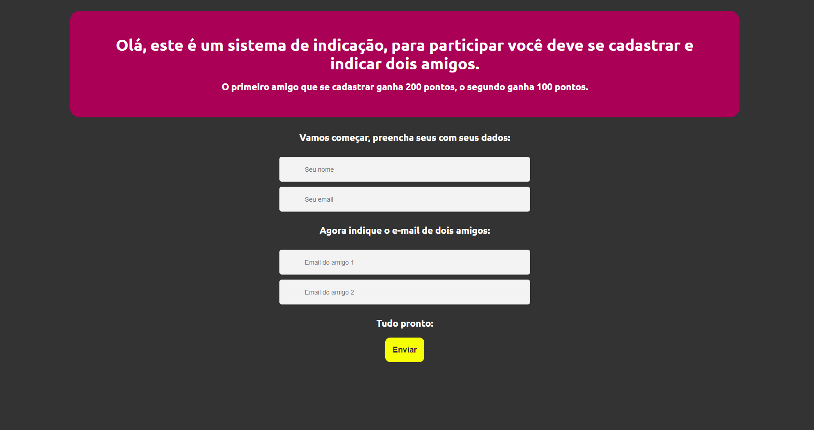
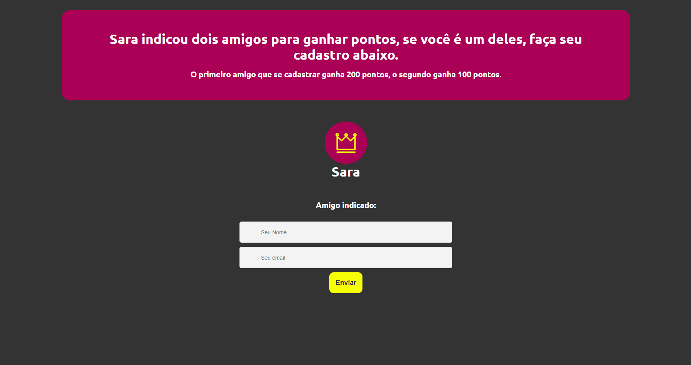
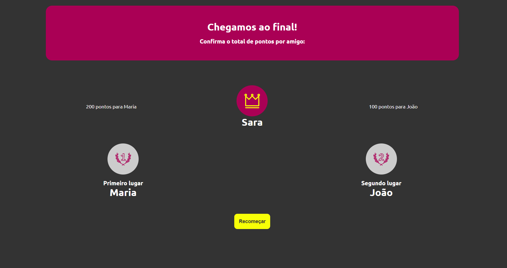

<p align="center">

  <a href="https://www.linkedin.com/in/saramargarido/">
    
  </a>

</p>

# Indication System
**Sistema básico de indicação**

http://sara.dev.br/projects/indicationsystem/

Webserver: PHP 8.x, SGBD: MySQL, phpmyadmin





Clonar o repositório

`$ git clone https://github.com/saramargarido/indicationsystem.git`

Acessar o diretório do repositório clonado

`$ cd indicationsystem`

**Instalar o Composer**

`$ composer install`

Gerar a chave:

`$ php artisan key:generate`

**Execução de Migrations**

`$ php artisan migrate`

Abrir o server:

`$ php artisan serve`

**Credencias do banco de dados**

Primeiro deve adicionar as credencias do banco de dados no arquivo .env

Exemplo

```
DB_HOST=db
DB_PORT=3306
DB_DATABASE=anexus
DB_USERNAME=user
DB_PASSWORD=
```


